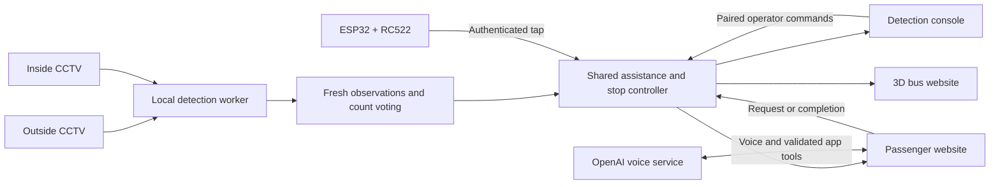

# BusGuard / BusTech — Connected passenger assistance

A local-network prototype for the **SGBTGC 2026 / BusTech** accessibility project. Two CCTV views, RFID boarding records and passenger requests feed one shared controller. Three websites show the same bus journey: an operator detection console, an interactive 3D bus and an accessible passenger app.

**Physical inputs:** CCTV cameras and an ESP32 + RC522 RFID reader. **Simulated outputs:** bus motion, stops, doors, ramp and mobility-position confirmation. This project does not control a physical bus or certify that a passenger is safely seated or secured.

## Start here

| What you need | Guide |
| --- | --- |
| Understand the complete journey and timing | [System workflow](docs/SYSTEM_WORKFLOW.md) |
| Understand services, models and data flow | [Architecture](docs/ARCHITECTURE.md) |
| Install on another computer or connect phones | [Setup and operations](docs/SETUP_AND_OPERATIONS.md) |
| Integrate another device or application | [API reference](docs/API_REFERENCE.md) |
| Find the relevant code | [Project file map](docs/PROJECT_FILE_MAP.md) |
| Prepare a repeatable demonstration | [Demonstration guide](docs/DEMONSTRATION_GUIDE.md) |
| Configure ESP32 pins and Arduino firmware | [RFID firmware guide](firmware/BusGuardRFID/README.md) |
| Set up OpenAI voice and phone HTTPS | [Voice setup](docs/VOICE_SETUP.md) |
| Review dependency/model licensing | [Third-party notices](THIRD_PARTY_NOTICES.md) |

The current guides describe the implementation as of **29 September 2026**. Older design and validation notes remain in the repository for context; their earlier timers, posture models and workflows are not the current specification.

## The three websites

| Website | Default host URL | Main functions |
| --- | --- | --- |
| Detection console | `http://localhost:4479/` | Two independent input cards; object/phrase detection; per-class confidence; count voting; standing check; bus scenario; RFID profiles; operator controls |
| 3D bus | `http://localhost:4480/` | Singapore-inspired autonomous bus, 6 priority and 20 standard seats, two doors and cameras, moving road/wheels, animated ramp, exterior information display and movable status panel |
| Passenger app | `http://localhost:4481/` | One assistance choice per request, current stop/route, seat availability, request countdown, arrival reminders and accessibility preferences |
| Secure passenger app | `https://<SERVER_IP>:4482/` | The same passenger application with microphone access, when its certificate is trusted by the device |

On another device, replace `localhost` with the server computer's current LAN IP. The 3D scene renders on the device that opens it, so a second laptop or tablet can render the bus while the server GPU performs inference. All sites still read the same controller state.

## What the prototype provides

- **Two camera perspectives.** Outside detection looks for boarding activity and assistance-related objects. Inside detection counts passengers throughout the trip and checks standing after the doors are fully closed.
- **Flexible inputs.** Each detection card supports RTSP CCTV, a browser camera, images and recorded videos. Images and recordings are test inputs; they cannot clear live departure readiness.
- **Stabilized observations.** Tracking, box smoothing and time-weighted count voting reduce flicker. Confidence settings are separate for configured detection categories.
- **Explicit assistance requests.** Passengers can request ramp access, extra time, priority seating, audio guidance or visual guidance. Each request selects exactly one option. Age and pregnancy are not inferred from appearance.
- **RFID passenger records.** A registered card's first accepted tap boards its passenger; the next accepted tap alights them. Profiles support ordinary, senior, pregnant and custom passenger types. Priority announcements ask other riders to offer a seat when needed.
- **Shared availability.** Capacity is 26 seats: 6 priority and 20 standard. Ordinary passengers may use available priority seats; priority requests can trigger a polite reminder. Seat-group allocation is an estimate, not camera recognition of the individual seat occupied.
- **Accessible feedback.** Large visual messages, high contrast, reduced motion, optional spoken updates, arrival notifications and supported-device vibration.
- **Voice assistance.** “Hey BusGuard” or the talk control activates the OpenAI Realtime assistant. It can operate the supported passenger-app actions through validated callbacks. It cannot operate bus motion or bypass the controller.

## How the parts work together



The backend owns the decisions. The websites display its state; a locally animated door or a countdown reaching zero is not an independent permission to depart. Camera observations, passenger requests and RFID events retain separate meanings rather than being added together as three passenger counts.

## Current stop and departure rules

1. Start the demonstration, then use **Stop** to approach the next station on the A → B → C → D → E → A loop. Later arrivals require the next Stop command; travel does not automatically advance to an arrival.
2. The bus announces the approaching stop, slows down and opens the simulated doors. The initial quiet boarding window is **15 seconds from fully open doors**.
3. Fresh **outside-camera** activity renews the quiet window, bounded by the admission cutoff. Inside-camera counting does not extend boarding.
4. An accepted RFID tap grants **10 seconds from that tap**. An accepted ramp request grants **20 seconds from that request**; other accepted app requests grant **10 seconds**. These protect the later existing deadline rather than blindly adding time to it.
5. New taps and requests stop being accepted **50 seconds after the doors opened**. An allowance accepted before the cutoff finishes in full: an RFID tap at 49 seconds can keep access open until 59 seconds, and a ramp request at 49 seconds until 69 seconds. Further activity cannot reopen admission.
6. If activity stops earlier, doors close earlier; the bus does not wait for 50 seconds unnecessarily. A departure announcement must have had its full **10 seconds** before movement. Holds or a late announcement can delay departure.
7. Once doors are fully closed, the enabled inside standing check needs **five continuous seconds of fresh live results with no standing detected**. Standing, stale/disconnected input or a source change resets that confirmation. Old track IDs or an unrelated historical passenger count do not invalidate a successful standing-only check.
8. Departure proceeds when the standing check and the other controller conditions are clear. The three-second minimum **closed-door** interval runs alongside this check; it is not an extra wait after the five-second confirmation. The door-closing animation finishes before standing confirmation begins. Doorway, emergency, mobility-review and other controller holds still apply.
9. While travelling, a standing detection produces a seated-passenger reminder. It does not trigger an abrupt stop. The next Stop command starts the next station cycle.

See the [workflow guide](docs/SYSTEM_WORKFLOW.md) for exact state transitions, request lifecycle and failure behavior.

## Counting is separate from standing

The live object table uses a rolling time-weighted vote to stabilize each category. It is not a calibrated probability and category totals can overlap.

Onboard occupancy has a different job:

- Accepted RFID board/alight events adjust the record by **+1 / −1**.
- When whole-cabin coverage is enabled, the inside camera provides **one fresh person sample each second**.
- A complete 30-sample cycle corrects the occupancy baseline using the rounded arithmetic mean. Incomplete or stale cycles do not imply zero passengers.
- Assistance-request completion does not add another passenger to the RFID/camera count.
- Standing checks use the separate `standing person` result immediately. They do not wait for the 30-second occupancy correction and do not classify sitting.

“No standing detected” means that this detector did not detect standing in valid recent frames. It is not proof that everyone is seated. Validate the camera view, thresholds and false-negative behavior before presenting results.

## Models and processing

| Task | Active implementation |
| --- | --- |
| Ordinary objects and people | YOLOE, default local checkpoint `yoloe-26m-seg.pt` |
| Standing-only check | A separate YOLOE `standing person` prompt, using the same serialized inference worker |
| Detailed descriptive phrases | Grounding DINO Tiny in the hybrid backend, with phrase handling and clothing-color checks |
| Temporal stability | Tracking, box filtering and time-weighted per-category count voting |
| 3D rendering | Three.js in the viewer browser |
| Passenger voice | OpenAI Realtime, with a private server-side API key |
| Announcements | OpenAI speech audio with a shared playback queue; text remains available |

MediaPipe and LocateAnything adapters are retained as historical/optional code. They are not the active standing check. The default model is pretrained, not fine-tuned for this cabin. Detailed phrase matching and standing recognition need camera-specific evaluation; smoothing cannot repair a consistently wrong classification.

A bounded inference queue avoids building an ever-growing backlog. The two feeds share one worker/model owner. Outside inference pauses when doors are not fully open; the video connection and inside counting have separate lifecycles. GPU capacity, camera encoding and network buffering still affect end-to-end latency.

## Quick start

For a computer already configured with this project:

- `start-lan.cmd` starts the normal three websites on the local network.
- `start-lan-voice.cmd` also starts the HTTPS passenger site after certificate setup.
- `start.cmd` starts localhost-only access.

For a fresh clone, first follow [Setup and operations](docs/SETUP_AND_OPERATIONS.md). It covers creating `.venv`, installing the correct PyTorch build, pinned dependencies, model downloads, firewall rules and certificates. The source does not include model weights, Python environments, private credentials or saved passenger data.

A host-side six-digit pairing code authorizes remote operator devices. Passenger and 3D viewer access do not require that code. An ESP32 uses its own dedicated reader token, not the pairing code or OpenAI API key.

After changing Wi-Fi, use the new server address and restart the server so its allowed hosts match. Phone HTTPS also needs a certificate matching the new address. After any server restart, reconnect camera sources and use **Reset held simulation** after reviewing the demonstration state.

## Passenger voice behavior

Enable microphone access on a trusted HTTPS passenger page. While listening, audio is sent to OpenAI to recognize the wake phrase; this is not an offline wake-word model.

- Say **“Hey BusGuard”**, then the request, or use the talk control.
- The microphone pauses while the assistant prepares and speaks a reply. Speech during the reply cannot interrupt it or queue another command.
- Listening resumes after the complete audio playback. A three-second follow-up window then starts; silence returns the assistant to standby.
- Replies default to one short sentence, with a second for an essential next step. More detail is reserved for an explicit request.
- **Stop listening** stops the session immediately. **Enable reply audio** handles a browser playback block without cancelling the reply.
- Requests, reminders and setting changes still use the normal app checks. Voice cannot grant a seat, change the simulated location, open admission or bypass departure holds.

Microphone, browser notifications and vibration depend on browser/device support. Arrival reminders require the page to remain open; switching apps or locking the phone can suspend it. iPhone web vibration is not promised.

## Validation and demonstration boundaries

See [current source validation](docs/VALIDATION_CURRENT.md) for the 29 September 2026 checks and their limits.

```powershell
.\.venv\Scripts\python.exe -m pytest tests -q
npm ci
npm test
npm run build:bus
```

Tests cover decision timing, stale observations, occupancy reconciliation, RFID duplicate protection, API authorization, passenger state and voice turn handling. They do not establish real-bus safety or measured cabin detection accuracy. Use the [demonstration guide](docs/DEMONSTRATION_GUIDE.md) to show both successful assistance and failure handling, and record false positives, false negatives and end-to-end delay separately.

## Source and local data

This source copy uses synthetic RFID card IDs and omits private machine settings. Configure your four cards before the first run using the [RFID guide](firmware/BusGuardRFID/README.md). The original running installation is separate and is not changed by this source export.

- Source and configuration templates are shareable; populated `config.h`, `.env` files, `data/`, recordings and TLS private keys are local.
- Download model weights separately. Generated local caches, installed packages and validation media are excluded from publication.
- Demo RFID UIDs identify cards, not people. They are not secure fare credentials. The four UID mappings are preconfigured in `vision/rfid.py`; the console edits their passenger profiles, not the UIDs. New card enrollment is not implemented in the console. Keep private reader tokens out of Git.
- First-party project licensing has not been separately declared here. Dependencies and models retain their own licenses; see [third-party notices](THIRD_PARTY_NOTICES.md) and the included notices before reuse or redistribution.
