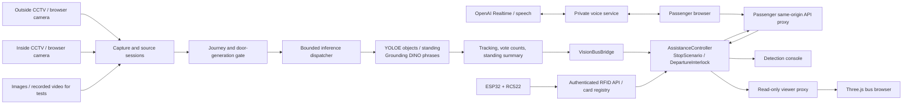
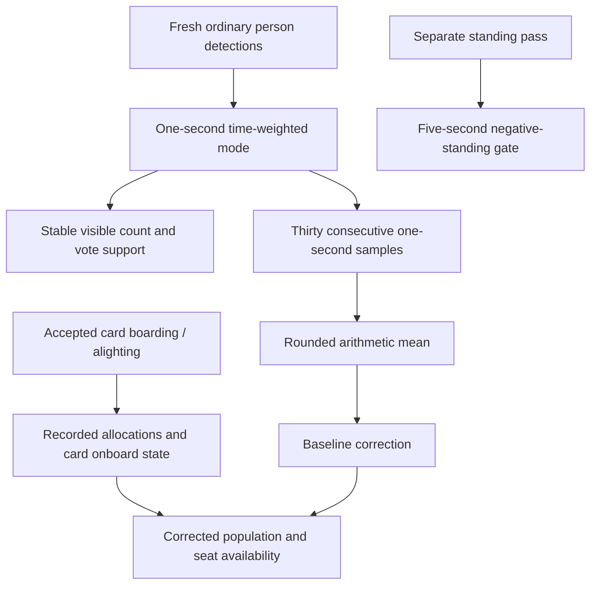

# BusGuard architecture

BusGuard is a local Python service with three web experiences sharing one authoritative assistance controller. Model inference runs on the host; browser interfaces display or request state changes through constrained HTTP APIs. This separation keeps the 3D rendering workload off the inference computer when the viewer is opened on another device.

Read [System workflow](SYSTEM_WORKFLOW.md) for the exact stop timing, standing rule, RFID behavior and passenger journey. This document explains how those behaviors are implemented.

## Components and connections

`run.py` starts the primary FastAPI/Uvicorn detection service and additional viewer/passenger Uvicorn servers in threads. The secondary websites forward only their allowed API operations to the primary service on loopback. They do not create independent bus state or load additional detection models.

| Layer | Main implementation | Responsibility |
| --- | --- | --- |
| Launcher/configuration | [`run.py`](../run.py), [`vision/config.py`](../vision/config.py) | Backend/device selection, LAN binding, site ports, optional passenger HTTPS. |
| Main API | [`vision/api.py`](../vision/api.py) | App lifecycle, uploads, sessions, camera controls, public snapshots, operator access. |
| Inference scheduling | [`vision/scheduler.py`](../vision/scheduler.py) | One model-owning worker, bounded pending work, cancellation and interactive/background fairness. |
| Model adapters | [`vision/backends.py`](../vision/backends.py), [`vision/grounding.py`](../vision/grounding.py) | Normalize inference results and route object/phrase modes. |
| Frame pipeline | [`vision/sessions.py`](../vision/sessions.py), [`vision/rtsp.py`](../vision/rtsp.py) | Per-source state, capture, latest-frame processing, matching results/previews. |
| Visual stability | [`vision/tracking.py`](../vision/tracking.py), [`vision/counting.py`](../vision/counting.py) | Stream-local tracks, smoothed display boxes and time-weighted count voting. |
| Observation bridge | [`vision/bus_bridge.py`](../vision/bus_bridge.py) | Latest inside/outside observations, aging and deduplicated assistance events. |
| Bus controller | [`vision/assistance.py`](../vision/assistance.py), [`vision/scenario.py`](../vision/scenario.py) | Shared requests, simulated actuators, route cycle, deadlines, readiness and seat accounting. |
| Standing/cabin count | [`vision/standing.py`](../vision/standing.py), [`vision/departure.py`](../vision/departure.py), [`vision/cabin_audit.py`](../vision/cabin_audit.py) | Standing-only inference, fresh five-second gate and 30-second mean correction. |
| RFID | [`vision/rfid.py`](../vision/rfid.py), [`vision/rfid_api.py`](../vision/rfid_api.py) | Profile registry, authenticated readers, deduplication and onboard-card ledger. |
| Voice | [`vision/voice.py`](../vision/voice.py), [`static/passenger/voice.js`](../static/passenger/voice.js) | Private key usage, Realtime connection, speech generation, wake gate and restricted tools. |
| Frontends | [`static/app.js`](../static/app.js), [`static/passenger/app.js`](../static/passenger/app.js), [`static/bus/src/app.js`](../static/bus/src/app.js) | Detection, passenger and Three.js experiences. |

## Detection pipeline and model selection

The default `hybrid` backend combines YOLOE for object categories with Grounding DINO for detailed phrases. The default object checkpoint configured in `run.py` is `yoloe-26m-seg.pt`. Phrase inference is explicitly selected; it does not silently replace an unsupported phrase with generic person detections. Optional YOLOE-only, Grounding DINO, LocateAnything and deterministic demo adapters remain in the repository.

Standing detection on the normal YOLOE/hybrid path uses a separate `standing person` inference through the same YOLOE owner thread. It is not action recognition across a video sequence and does not estimate a human skeleton or positively classify sitting. Legacy MediaPipe/semantic-seating files remain for compatibility and past experiments; they are not the active YOLOE standing path.

The object options include per-category confidence thresholds. Standing has its own configurable confidence. All normal results use a common detection representation with label, normalized bounding box, score where available, and optional track ID/predicted flag. A score is model confidence, not a calibrated probability that a passenger needs assistance.

For live and video sessions, `StableTracker` wraps BoT-SORT association and adaptive One Euro box smoothing. Track IDs are local to a stream and can change. Short visual predictions help overlays stay steady but are excluded from observed count voting and cannot keep a stop open as new passenger activity.

The YOLOE adapter caches text embeddings and reuses a supported native predictor while switching prompts. This avoids rebuilding/warming the predictor for every alternation between ordinary categories and the standing prompt. It retains fallback paths for runtimes where predictor reuse is not safe. Performance should be measured on the actual GPU and camera resolutions; this optimization is not a guarantee of a fixed frame rate.

### Preventing a backlog of old video

Each session has increasing frame IDs. A later source/frame can supersede obsolete work, and closed or replaced sessions cannot publish late results. The dispatcher has one model-owning worker and a bounded queue; work for the same session replaces pending work instead of building an unbounded FIFO.

RTSP capture and inference are separate loops. FFmpeg continuously decodes the stream, while inference consumes the newest available frame and records skipped frames. A watchdog and bounded reconnection attempts handle stalled streams. Credentials are not included in public state. Camera previews are aged separately and stale posture overlays are removed.

The browser live camera can show live video with short-lived overlays or a matched detection frame. It keeps a bounded in-flight request rather than queuing every display frame. RTSP transport/camera buffering, GPU work, Wi-Fi and browser rendering can still add latency; the system exposes timing and age fields for diagnosis.

### Door transitions are explicit generations

`DetectionGate` snapshots a source policy at frame receipt. Outside inference is allowed only while stationary with fully open doors; inside counting has a stable always-enabled generation. Standing has a separate door-generation token and runs only with closed doors and the source option enabled.

The token is checked again around inference/final publication. A frame captured before closure cannot become post-closure standing evidence merely because it finished processing later. This prevents stale cross-phase decisions and avoids restarting the whole inside source for every door change.

## Observations are separate from decisions

`VisionBusBridge` maintains the latest selected source for each role. A source snapshot includes connection/kind/session/frame metadata, ages, ordinary detections, count summary and the standing summary. It ages results as time passes; polling does not manufacture a new observation.

The bridge can emit assistance-category presence events from the outside source after repeated observations. The controller checks source kind, freshness, current stop/cutoff and deduplication before creating an assistance request. Image/video tests and the demo adapter do not silently become real-time cabin or boarding evidence.

The main API starts a controller task with an approximately 200 ms interval. It reads the bridge snapshot, calls `AssistanceController.tick()`, advances the simulation and persists meaningful state changes. The loop is independent of whether a dashboard is open. An exception latches a hold rather than allowing motion to continue from partially processed state.

`AssistanceController` uses a lock to coordinate requests, card accounting and snapshots. `StopScenario` owns the open-door/admission deadlines. `DepartureInterlock` owns the standing confirmation. These are separate because:

- A boarding timer can expire without granting permission to move.
- A model can report zero standing while a doorway or mobility hold remains.
- The inside passenger count must continue while outside inference is paused.
- A camera count and an RFID count represent alternative measurements of the same population, not two populations to add.

## Counting has two distinct timescales

One-second voting stabilizes rapidly fluctuating counts. The 30-second audit reconciles the occupancy estimate over a longer interval, with equal weighting per second. Missing evidence resets an incomplete audit; it is never interpreted as an empty cabin. RFID changes update the same corrected baseline between completed audits.

Standing clearance does not wait 30 seconds for a population audit, nor does it require an old tracking-ID roster to reappear. Conversely, a successful standing check does not prove a count is correct or identify seat locations. These separations are important when modifying the controller.

## APIs and authority boundaries

The paths below are a component map, not a replacement for the Pydantic request schemas. The primary service exposes its OpenAPI JSON for detailed schemas. Passenger and viewer services deliberately have smaller surfaces.

| Endpoint group | Typical operations | Who uses it |
| --- | --- | --- |
| `/api/status`, `/api/site`, `/api/access` | Model/site/access metadata | Browser setup and status. |
| `/api/access/pair` | Pair a LAN operator browser using the host's six-digit code | Operator only; code is shown to the host via loopback. |
| `/api/sessions` and `/api/sessions/{id}/frames` | Create source session and submit frames | Authorized detection console. |
| `/api/bus/cameras/{role}` | Configure/status/disconnect an inside or outside RTSP camera | Authorized operator. |
| `/api/bus/cameras/{role}/preview.jpg` | Current camera preview | Authorized detection console. |
| `/api/videos`, `/api/jobs`, `/api/library` | Upload/analyze/export recorded test video | Authorized detection console. |
| `/api/bus/state` | Combined observations and controller snapshot | Console and read-only 3D viewer. |
| `/api/assistance/config`, `/api/assistance/state` | Route/options and shared passenger state | Passenger app. |
| `/api/assistance/requests` | Submit one assistance choice | Passenger app, subject to server checks. |
| `/api/assistance/requests/{id}` and `/complete`, `/cancel` | Read or act on the passenger's own request | Requires its private request token. |
| `/api/assistance/control`, `/api/assistance/scenario` | Demo lifecycle, explicit holds/revalidation, scenario actions | Authorized operator. |
| `/api/rfid/cards`, `/api/rfid/readers`, `/api/rfid/test-tap` | Configure profiles/readers and test taps | Authorized operator. |
| `/api/rfid/reader-state`, `/api/rfid/tap` | Read current window and submit hardware tap | Provisioned reader with bearer credential. |
| `/api/voice/config`, `/api/voice/session`, `/api/voice/session/close`, `/api/voice/speech` | Voice availability, session exchange and announcements | Passenger/viewer according to the site's allowlist. |

The passenger service proxies only configuration/state and request operations, plus approved voice operations. It cannot forward arbitrary operator control URLs. The 3D viewer fetches read-only state, not camera frames or RTSP credentials. Same-origin checks, trusted hosts, upload limits and security response headers reduce accidental cross-site access. LAN operator pairing is session-based; a server restart creates a new pairing session/code.

This is a private-network demonstration. Plain HTTP camera/operator/RFID transport is not an Internet production security design. Do not expose the service with router port forwarding or publish local credentials, journals, certificates/private keys or model-generated caches in source control.

## RFID event consistency

The reader sends UID, reader ID, event ID, current window ID and a recent server-relative observation timestamp. The server validates the reader token, scan age, window, card profile, debounce, capacity and open-door admission state.

The four card UID mappings are predefined by `CARD_UIDS` in `vision/rfid.py`. Operator card updates change the passenger type/custom profile, not the UID. There is no new-card enrollment endpoint or console workflow; changing the card set requires a deliberate implementation/data migration, because journal restore validates those mappings.

An event fingerprint ties a retry to its original scan. An exact retry returns the earlier receipt; reusing an event ID with different data is rejected. Accepted tap state and occupancy are committed together in the assistance journal, so a network retry does not board and immediately alight a passenger. A registered card retains its onboard allocation independently of later profile edits.

The camera reconciliation is an adjustment beside this ledger. It does not invent card identities. An alighting tap subtracts once from the recorded/corrected count, including when a camera correction has changed the apparent population.

## Voice and announcements

The API key is read by the host-side `VoiceService`, never embedded in the passenger JavaScript. The browser creates a WebRTC connection and exchanges session data through the voice endpoint. Voice tools call ordinary app/controller paths and do not have an actuator bypass.

`voice-core.js` and `voice.js` maintain activation, turn permission, standby and tool validation. A reply uses a fresh status read before stating live location/seats/time. The current turn mode blocks microphone input while a reply is being prepared/played, resumes afterwards, and returns to standby after the three-second follow-up window. Input suppression is implemented by the client as well as `interrupt_response: false` in the Realtime session configuration.

Arrival reminders and display/preferences actions are handled in the passenger app. Bus motion and emergency controls are outside the voice tool set. The assistant reports success only after a request succeeds, and missing state is reported as unavailable rather than inferred.

Announcement speech is generated from permitted public phrases and cached locally. Routine messages are queued through shared browser audio coordination; relevant urgent guidance may interrupt a lower-priority reply. API failures are surfaced and retried with bounds rather than silently claiming speech played. The model IDs and voices are configurable/source-defined details that may require updates as service availability changes; see [Voice setup](VOICE_SETUP.md).

Voice is an optional cloud dependency. Local CCTV decisions and the controller do not need OpenAI, while OpenAI voice requires Internet access, billing and microphone/browser permissions. A LAN HTTP address is not a secure microphone origin on a phone; the optional HTTPS site must use a certificate that matches the current host address and is trusted by that device.

## Persistence and restart behavior

The assistance journal contains request records, simulated seat ledger, RFID profiles/onboard state and reader credential hashes. Request ownership tokens are stored as hashes. Updates use temporary-file replacement; journal failures hold the demonstration. Public request summaries omit private request handles and passenger/card identity details.

Restoring a journal does not resume an old departure countdown. The controller marks revalidation required, restores the scenario held, and waits for explicit operator review/reset. Current camera sessions, fresh standing confirmation and partial 30-second audit windows must be rebuilt. This is why reconnecting cameras after a host restart is expected.

Model weights, uploaded videos, exports, private voice configuration, RTSP URLs, TLS keys and reader configuration have different retention/security needs from source code. Keep them outside a published source snapshot. Example configuration files show the required fields without distributing live secrets.

## What the browser renders

The 3D model and scenery are authored in Three.js source under `static/bus/src/`. `model.js` constructs the bus; `road.js` and `travel-motion.js` make travel visible; `entrance-led.js` renders current seats/timing; `message-panel.js` and `panel-layout.js` present the movable/minimizable information panel. `controller-state.js` adapts server state for rendering.

The viewer interpolates/animates state for presentation. It does not advance the authoritative stop clock or decide whether a passenger may board. The compact passenger route similarly represents the server's schematic position. Stale/offline state should remain visibly unavailable instead of continuing a misleading live count.

## Validation and known limits

The repository's Python and JavaScript tests cover timing boundaries, stale frames, source replacement, duplicate RFID taps, capacity, request ownership/location, camera reconciliation, voice turns and display state. Useful focused starting points include:

- [`tests/test_five_second_departure_flow.py`](../tests/test_five_second_departure_flow.py) and [`tests/test_standing_departure.py`](../tests/test_standing_departure.py)
- [`tests/test_quiet_empty_stop.py`](../tests/test_quiet_empty_stop.py) and [`tests/test_stop_scenario.py`](../tests/test_stop_scenario.py)
- [`tests/test_rfid_registry.py`](../tests/test_rfid_registry.py) and [`tests/test_camera_reconciliation.py`](../tests/test_camera_reconciliation.py)
- [`tests/test_cabin_audit.py`](../tests/test_cabin_audit.py), [`tests/test_voice.py`](../tests/test_voice.py) and [`tests/test_network.py`](../tests/test_network.py)
- [`scripts/check_dual_yolo_standing.py`](../scripts/check_dual_yolo_standing.py) for a model-backed dual-input diagnostic.

Unit and integration tests cannot establish standing-detection accuracy in a new bus, camera installation or lighting condition. Evaluate representative seated/standing/occluded passengers, quantify false positives and false negatives, and measure capture-to-result age under both-camera load. Temporal stabilization reduces flicker but cannot correct a consistently wrong model. Seat distribution and route position remain simulated estimates, and no physical door, ramp, restraint or braking feedback is connected in the current prototype.
