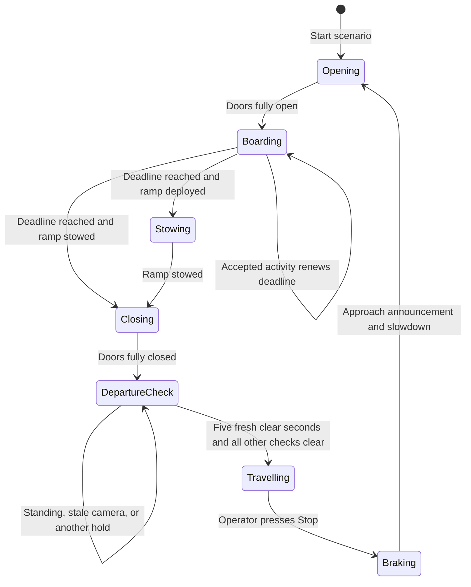

# BusGuard: how the demonstration works

BusGuard connects two camera inputs, an ESP32 RFID reader and passenger assistance requests to one shared bus demonstration. The detection console, passenger website and 3D bus display all read the same controller state. A request submitted on a phone can therefore appear on the operator console and change the simulated doors, ramp, countdown and announcements.

This document describes the implementation in this repository as of September 2026. It takes precedence over older design notes when they describe a ten-second seating timeout, MediaPipe as the active standing detector, or a hard door-closing deadline at 50 seconds.

**Real inputs:** CCTV/browser cameras, RFID card taps and passenger requests. **Simulated outputs:** bus movement, route position, doors, ramp and seat assignments. The software does not drive a physical bus or verify a wheelchair restraint. Its decisions are suitable for an explained prototype demonstration, not a certified vehicle controller.

## The three websites

| Website | Default port | Purpose |
| --- | --- | --- |
| Detection console | 4479 | Configure inside/outside sources and detection thresholds; inspect results, counts and holds; run the stop scenario; manage card profiles. |
| 3D bus | 4480 | Display the shared journey, animated road/wheels, doors/ramp, entrance information display and passenger information panel. It renders on the viewing device. |
| Passenger app | 4481 | Request assistance, see seats and the schematic route, follow a request countdown, configure accessibility and arrival alerts. |
| Secure passenger app | 4482, when configured | The passenger app over HTTPS for microphone access on phones. A matching, trusted certificate is required. |

The model runs on the host computer. Opening the 3D site on a second device moves its graphics work to that device; it does not start another detector. The route is an A → B → C → D → E → A demonstration, not GPS tracking.

## One stop, from arrival to departure

The operator starts the scenario, then uses **Stop** to trigger arrival at the next station whenever the bus is travelling. Route animation alone never automatically triggers another stop.

Doorway obstruction can keep the doors open or reopen them during closure. Emergency or restart revalidation can hold the cycle. These paths are omitted from the compact diagram, but remain part of the controller.

1. **Approach.** On Stop, the simulation announces the next station and brakes over approximately two seconds.
2. **Open.** The bus becomes stationary and the doors animate open. The stop clock begins when the doors are fully open, not when Stop was pressed.
3. **Board or alight.** The initial no-activity window is **15 seconds**. Outside-camera activity and accepted RFID taps can renew the door-open deadline. Passenger requests receive their own allowance.
4. **Close admissions.** New RFID scans and assistance requests are rejected once the stop clock reaches **50 seconds**. An allowance accepted before that cutoff can finish afterwards.
5. **Close access.** When the current door-open deadline expires, unresolved requests expire, the ramp stows if necessary, and the doors close if the doorway is clear.
6. **Check standing.** With doors closed, the inside camera must produce **five continuous seconds of fresh, valid results with no standing person detected**. Standing or missing evidence resets that check.
7. **Depart.** The bus moves when the standing check, announcement interval and other readiness conditions are clear. It then remains travelling until the next operator Stop command.

An empty stop does **not** have to wait 50 seconds. With no activity, the doors begin closing after the initial 15 seconds. Closure animation and the fresh five-second standing check follow. The exact visible departure time also depends on camera evidence and any outstanding holds.

## Stop timing: what changes which deadline?

Let `t = 0` be the moment the doors fully open and `D` be the current door-open deadline. Initially `D = 15` seconds.

| Event | Effect while admissions are open |
| --- | --- |
| Fresh outside live-camera detection | `D = max(D, min(50, detection_time + 15))` |
| Accepted RFID boarding or alighting tap | `D = max(D, tap_time + 10)` |
| Accepted ordinary passenger assistance request | `D = max(D, request_time + 10)` |
| Accepted ramp assistance request | `D = max(D, request_time + 20)` |
| Inside-camera person or standing result | Does not renew the boarding deadline. It updates cabin observations/checks. |
| Repeated dashboard poll, old frame, predicted track, uploaded test image/video | Does not count as fresh outside boarding activity. |
| Rejected, duplicate or debounced card tap | Does not add a new allowance or change occupancy. |

Extensions are deadlines measured from the accepted event; they are **not cumulative additions to the current deadline**. A tap during an already longer ramp allowance cannot shorten or repeatedly stack that allowance.

Examples:

- With no activity, `D = 15`.
- A tap at 12 seconds moves `D` to 22 seconds. Another accepted tap at 21 seconds moves it to 31 seconds.
- A tap at 49 seconds can keep the doors open until 59 seconds. New taps from 50 seconds onward are rejected, with a polite announcement to wait for another bus.
- A ramp request accepted at 49 seconds can finish its allowance at 69 seconds. It does not reopen admissions after 50 seconds.
- An outside detection at 49 seconds renews its quiet window only as far as 50 seconds. The beyond-cutoff allowance applies to already accepted requests/taps.

The controller also schedules a **ten-second departure notice** from its current planned departure time. It never backdates an announcement. If activity moves departure sufficiently later, it postpones the notice and issues another when appropriate. The five-second standing check and the notice can overlap; there is not an additional mandatory three-second wait after the five clear seconds. The code retains a three-second minimum closed-door interval, which the five-second standing requirement already exceeds.

A countdown is a current plan, not a guarantee that the bus will move at zero. Holds can remove the departure estimate entirely.

Implementation: [`scenario.py`](../vision/scenario.py), [`assistance.py`](../vision/assistance.py).

## The two cameras have different jobs

| Bus condition | Outside camera inference | Inside person counting | Inside standing inference |
| --- | --- | --- | --- |
| Doors opening, open or closing | Only when fully open and stationary | Runs while its live source remains connected | Paused |
| Doors closed, before departure | Paused | Runs | Runs when the standing option is enabled |
| Travelling with doors closed | Paused | Runs | Runs; standing triggers reminders rather than immediate braking |

The source boxes accept camera, image and video inputs for testing. Only a connected **live**, non-demo inside source supplies departure and camera-reconciliation evidence. For the cabin, select object mode with the literal `person` category, enable the standing check, and confirm that the camera covers the whole cabin. A detailed phrase such as a clothing description observes a subset of people and is not a cabin census.

Outside assistance categories can generate deduplicated assistance events: wheelchair/pram can request ramp assistance; walking-aid categories can request time and priority seating. The controller does not infer pregnancy or invisible needs from appearance. RFID profiles and explicit app requests express those needs.

Source and door generations prevent a frame captured in an earlier phase from being reused after a transition. Pausing outside inference should therefore not require repeatedly replacing the inside camera session.

Implementation: [`detection_gate.py`](../vision/detection_gate.py), [`sessions.py`](../vision/sessions.py), [`bus_bridge.py`](../vision/bus_bridge.py).

## Standing detection and the five-second departure check

The current path uses **YOLOE with the `standing person` prompt**. It performs a separate standing pass using the shared object detector; it does not classify sitting. The standing threshold is configurable independently from ordinary object thresholds.

The departure gate requires all of the following:

- The doors are closed and the source belongs to the current door cycle.
- The inside source is live, connected and not a generated demo or uploaded test input.
- Frame identity, capture time, receipt time and result structure are valid and current.
- The standing pass completed successfully and explicitly reports valid negative evidence.
- Fresh, increasing frames continue for five seconds without a standing detection.

Repeated polling cannot advance this timer. A frozen frame, stale result, out-of-order capture, disconnected source, inference failure, camera replacement or reopened door breaks the confirmation. Standing evidence resets progress to zero, including a standing box that cannot be matched to a generic person track.

The standing-only result deliberately does **not** require stable identities for every passenger or prove that everyone is seated. Historical RFID occupancy and old tracking IDs cannot turn a valid zero-standing result into a demand to find an old passenger roster. The console may still show unresolved person-track diagnostics; those are separate from the valid standing result.

When already moving, new standing evidence causes a queued “please take a seat” reminder, rate-limited to approximately one every 20 seconds. It does not automatically stop a moving bus. When stationary after closure, standing continues to hold departure; the earlier ten-second posture override is no longer the active rule.

**Interpret the result correctly:** “No standing detected” means the configured model did not detect standing in valid recent frames. It does not establish true posture or physical safety. Occlusion, camera angle and model errors can still produce false negatives or positives. Validate with the actual cabin and representative passengers.

Implementation: [`standing.py`](../vision/standing.py), [`departure.py`](../vision/departure.py), [`tests/test_five_second_departure_flow.py`](../tests/test_five_second_departure_flow.py).

## Passenger count and available seats

The demonstration has **6 priority seats and 20 standard seats**, with a total capacity of 26. It keeps three distinct kinds of information:

1. **RFID/confirmed demo ledger:** accepted boarding increments the recorded population; an accepted second tap of that same onboard card records alighting and decrements it.
2. **Current camera observations:** ordinary `person` detections are stabilized over a one-second voting window.
3. **Thirty-second correction:** one fresh stable person count is sampled for each second of a complete 30-second cycle. Its rounded arithmetic mean corrects the displayed population baseline.

For the one-second vote, time matters rather than frame count. If the valid observed intervals report 7 people for 700 ms, 6 for 200 ms and 5 for 100 ms, the mode is 7 with 70% temporal support. The default support threshold is 65%, and a full window is required for an initial stable result. This support is not a calibrated probability that seven people are actually present.

For each 30-second audit, the latest valid stable count within each one-second bucket is used, so a high frame rate cannot overweight one second. The mean is `sum(30 samples) / 30`, rounded to the nearest integer with `.5` rounded upward. Missing/unstable/stale samples abandon the partial cycle instead of substituting zero. The whole-cabin coverage setting must be confirmed.

The result **replaces the population baseline rather than adding a second camera population to RFID**. Later accepted taps then adjust that baseline. The server accounts for taps that arrive around a completed camera-window boundary so they are not lost or counted twice. If the camera is offline, the last accepted ledger/correction remains; camera failure does not suddenly create 26 empty seats.

Priority/standard allocation is estimated from the ledger and total count. The camera does not identify which physical seat a passenger occupies. Ordinary passengers can use spare priority seats; a priority profile requests suitable allocation and a polite announcement asking passengers who do not need priority seating to move if a standard seat is available. Capacity checks include active seat reservations. Full buses reject further boarding while allowing a registered onboard card to record alighting during an open admission window.

Submitting or completing a passenger app request is **not proof of occupancy** and does not itself perform the RFID `+1/-1`. Requests reserve an available simulated seat while active; the count is established through accepted scans, explicit operator demo loads/actions and completed camera audits.

Implementation: [`counting.py`](../vision/counting.py), [`cabin_audit.py`](../vision/cabin_audit.py), [`cabin_count.py`](../vision/cabin_count.py), [`scenario.py`](../vision/scenario.py).

## RFID from the ESP32

Four named card profiles are managed as Card 1–4. Their UID mappings are preconfigured in `CARD_UIDS` in [`rfid.py`](../vision/rfid.py). The console edits passenger profiles; it does not enroll new card UIDs or change those mappings. The operator can choose normal, senior, pregnant or a custom passenger type. This is declared profile information, not an age/pregnancy diagnosis from a camera.

The ESP32 reads a card UID from the RC522, checks the server's current admission window, and submits an authenticated tap with a unique event ID, the window ID and an observation timestamp. The server owns whether that card is onboard, its profile and its allocation.

- A first accepted tap boards; the next accepted tap alights.
- Taps require fully open doors, a stationary bus and an open admission window.
- Stale scans, a changed window, unknown cards and too-rapid repeat scans are rejected.
- Retrying the same event returns its previous outcome rather than toggling occupancy again.
- Senior/pregnant profiles trigger a polite priority-seat announcement on boarding.
- There is no required LED attached to the ESP32. The console, reader response and bus announcements provide feedback.

The demo's two-second server debounce complements the reader's remove-and-retap handling. Card UIDs are identifiers, not secure proof of a person's identity; do not repurpose this prototype as fare-payment authentication.

See [`firmware/BusGuardRFID/README.md`](../firmware/BusGuardRFID/README.md) for wiring, libraries, configuration and upload instructions. Controller code is in [`rfid.py`](../vision/rfid.py) and [`rfid_api.py`](../vision/rfid_api.py).

## Passenger requests, arrival alerts and voice

The main screen presents assistance commands with a compact route and available seats. Settings contain accessibility choices and the demonstration location. Each new request chooses exactly **one** option: ramp, more time, audio guidance, visual guidance or priority seating.

For boarding, the selected passenger location and bus must match the current stop. For alighting, the passenger must select **On the bus** and request at the bus's current stop. All new requests also require the bus to be stationary and, in the timed scenario, the admission window to be open. Selecting Away or another stop prevents a boarding request. This is a scenario setting, not verified geolocation.

The request progresses through queued/assisting/awaiting-completion to completed, cancelled or error. The app shows its server-owned remaining allowance. The passenger confirms only after boarding or exiting. Allowances that expire without confirmation do not silently count the person as boarded. Ramp use also creates a separate mobility review requirement; an operator confirms the simulated securement because the camera cannot verify it.

An arrival reminder is different from an assistance request: it can target a later stop, does not reserve a seat and does not extend a stop. It uses the shared route's arrival event. Visual alerts, spoken alerts and optional vibration depend on device settings and browser support. Vibration is not guaranteed on iPhone. Keep the page open; this implementation does not promise background push notifications.

The optional OpenAI Realtime assistant activates with **“Hey BusGuard”** or a deliberate talk control. It can read current status, submit/complete/cancel the passenger's own request after explicit instructions, set/cancel arrival reminders, change supported accessibility settings and show app panels. It cannot operate doors, the ramp, emergency holds or bus movement.

The current conversation mode finishes its reply before accepting another voice turn. Microphone input is paused while preparing/speaking the reply, then resumes. Replies default to one short sentence, with a second when needed; instructions aim for at most about 40 words unless more detail is requested. After three seconds without conversation following completed speech/actions, or a spoken standby instruction, it returns to wake-word standby. Voice recognition still requires permission, HTTPS on phones, an active connection and supported browser behavior. Standby prevents unactivated replies/actions; it should not be described as an offline, entirely on-device wake-word engine.

Announcements use generated speech and a shared audio queue to avoid talking over routine messages. The 3D viewer has its own mute setting. Voice functionality requires the private API setup described in [`VOICE_SETUP.md`](VOICE_SETUP.md); the standard OpenAI API key remains on the server.

## Why a departure can legitimately remain held

| Hold reason | What to check |
| --- | --- |
| Standing detected | Seat the passenger, then supply five continuous seconds of fresh clear results. |
| No valid standing evidence | Connect the inside live source, use object mode with `person`, enable standing, and inspect freshness/model availability. A zero-looking preview is not enough. |
| Doorway obstruction | Clear the explicit obstruction control. Closure does not bypass it. |
| Mobility review after ramp use | Review and confirm the simulated mobility area/securement. Camera posture cannot perform this confirmation. |
| More than 26 passengers indicated | Check the RFID/demo ledger and live cabin count. Resolve overcapacity. |
| Active assistance | Complete/cancel the request, or let its allowance expire in the timed scenario. |
| Doors/ramp still moving | Wait for closure/stowing to finish. |
| Departure notice incomplete | Wait for the current ten-second notice interval. |
| Server restarted or emergency latched | Revalidate the demonstration and explicitly reset it from the operator console. |

After a restart, saved records are restored but old departure deadlines and camera confirmations are not. Reconnect sources and revalidate before restarting the simulated journey.

## Suggested repeatable demonstrations

1. **Quiet stop:** enable the live inside standing check; stop with no outside activity or taps; show the 15-second door-open window, five-second closed-door check and automatic departure.
2. **Late RFID tap:** keep boarding active until near 50 seconds, accept a tap at 49 seconds, show the remaining allowance past 50 and reject a new tap after cutoff.
3. **Ramp request:** submit one ramp option from a passenger at the current stop, show its 20-second allowance and access animation, then complete and explicitly confirm mobility review.
4. **Standing:** stand after doors close; show the reset/hold. Sit and show five fresh clear seconds. Repeat while moving to show a reminder without abrupt stopping.
5. **Count reconciliation:** tap known cards, collect a complete cabin-camera audit, and explain the mean/correction rather than calling every box an additional passenger.
6. **Failure case:** disconnect the inside source during the check or set an obstruction. Show why no fresh clear result/unsafe access does not become an automatic departure.

Use representative camera footage to assess detection precision/recall separately from timing tests. Passing controller tests establishes the software rules; it does not establish bus-wide perception accuracy.
