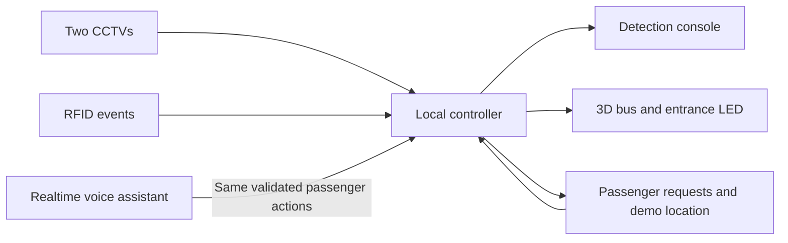

# BusGuard route and voice update

> **Historical route/feature update.** Read [System workflow](SYSTEM_WORKFLOW.md) for the current implemented behavior and [Setup and operations](SETUP_AND_OPERATIONS.md) for installation.

Status: updated requirements, 25 September 2026. The local controller remains
authoritative. See STOP_SCENARIO.md for exact timing and VOICE_SETUP.md for the
private API key and optional trusted HTTPS setup.

## Requested behavior

- Five schematic bus stops A, B, C, D and E, with an approaching-stop announcement.
- Passenger map showing the shared simulated bus position and a demo-location setting.
- Location-based boarding requests, arrival pop-up, spoken guidance and vibration where supported.
- Physical-looking exterior entrance LED showing remaining seats and the appropriate live timer.
- Ten-second inactivity window after accepted activity, without always waiting fifty seconds.
- Every accepted activity renews ten seconds from that activity, clipped at fifty seconds from doors fully open. A tap at second 49 receives only one second.
- Continuous inside counting; posture only after doors close, with three seconds of clear seated evidence and no timeout override.
- OpenAI Realtime passenger assistance and clearer bus announcements.

## Confirmed decisions

1. Ten-second inactivity window, with a hard fifty-second admission deadline.
2. The Stop button triggers the next A–E station; there are no automatic stops.
3. Posture never times out after closure. Standing or unknown posture holds departure; three continuous seconds of fresh seated evidence clears that check. Moving standing passengers receive a reminder without stopping the bus. Other holds remain.
4. OpenAI Realtime is integrated with a private server-side key setup. An API
   account is available, but credentials and live cloud testing remain user setup.
5. Every new app request requires the selected stop to be the current stationary
   stop. Boarding needs a matching at-stop demo location; alighting needs On board.
6. Android and iPhone are supported through the web interface. Device vibration
   is browser-dependent; the visual and spoken arrival alerts remain available.

## Shared state and boundaries

Route state, arrival event IDs, eligibility, capacity and timers belong to the
server. Displays interpolate remaining durations but do not decide when to depart.
The map uses schematic coordinates labeled as a demonstration, not live GPS.
An operator-selected passenger location is a demo setting, not a verified geofence.
The voice assistant can report state and submit the passenger's own permitted
requests; it does not directly command doors, ramp or vehicle movement.

Prefer distinct admission, last-activity, request-completion, closed-door posture
and departure-notice deadlines. An accepted request's completion and retry must
not become a new admission. Preserve private request ownership and idempotency.
Require three continuous seconds of fresh post-closure seated observations. Camera loss, standing or unknown posture resets confirmation; no automatic timeout permits departure. Preserve the existing departure warning without treating it as proof of seating.

The existing journal restores into a revalidation hold. Preserve that property.
Five display names can retain the existing first three internal stop IDs to avoid
breaking stored passenger requests; canonical ID migration is an alternative.

## Voice and arrival delivery

OpenAI's Realtime documentation supports browser WebRTC with session initialization
through the application server; the standard API key stays on that server.
Current examples use `gpt-realtime-2.1`. Functions should call the same controller
validation used by the form and return actual results before claiming success.
Do not include private request tokens in model prompts or tool arguments.

Fixed bus announcements use cached generated clips using
`gpt-4o-mini-tts` and previewable `marin` / `cedar` voices. Do not expose an
unrestricted public text-to-speech endpoint or generate audio per countdown tick.
The voice instructions should request calm, clear, concise public-transport
delivery. Generated speech must be identified as AI-generated.

Microphone use requires a secure context: localhost or trusted HTTPS. The current
plain-HTTP LAN passenger URL cannot provide microphone access on another device.
Do not bypass certificate warnings, silently install trust roots, or publish the
local controller to the internet. Private HTTPS setup needs to be made explicit.

“Hey BusGuard” needs an enabled microphone/listening session. A web page cannot
promise always-on wake-word operation while a phone is locked or the browser is
suspended. If wake detection uses cloud transcription, disclose that audio is
sent while listening is enabled; do not claim it is an on-device detector.

Use an in-page accessible arrival alert on all devices, deduplicated by the
server's arrival-event ID. Voice, device vibration and optional system
notifications depend on user activation, permission and browser support. Keep
the large visual alert and screen-reader announcement available as fallbacks.
Browser vibration does not work in every browser, including iOS Safari.
Hidden-page delivery requires a separate push strategy; normal polling cannot
promise a reliable locked-screen alert.

## Required verification

- Activity accepted at 49 seconds, rejection exactly at 50, and completion of an already accepted request.
- Quiet stop ends without reaching fifty seconds; RFID retries cannot replenish its allowance.
- Closed-door posture holds indefinitely; three seconds of fresh seated evidence is required and stale/repeated frames cannot advance confirmation.
- Standing during travel produces a queued reminder without stopping; open-door phases never issue a posture reminder. Emergency/obstruction/mobility holds remain.
- Same-stop eligibility enforced by the API, including voice tools, with idempotent retries preserved.
- A–E arrivals are generated only by the server; alerts occur once per visit and survive reconnect without replay storms.
- LED and map show unknown/offline honestly and do not invent countdowns.
- All passenger module assets load on the separate passenger port.
- Voice disabled/setup/error states work without a key; live cloud testing requires configured credentials and microphone permission.

## Primary references checked on 24 September 2026

- [OpenAI Realtime WebRTC](https://developers.openai.com/api/docs/guides/voice-webrtc)
- [OpenAI Realtime conversations and function calls](https://developers.openai.com/api/docs/guides/realtime-conversations)
- [OpenAI text-to-speech voices](https://developers.openai.com/api/docs/guides/text-to-speech)
- [MDN vibration](https://developer.mozilla.org/en-US/docs/Web/API/Navigator/vibrate)
- [MDN notification permission](https://developer.mozilla.org/en-US/docs/Web/API/Notification/requestPermission_static)
- [W3C vibration implementation report](https://w3c.github.io/vibration/reports/implementation.html)
